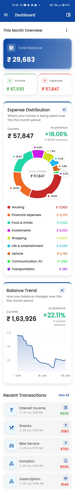
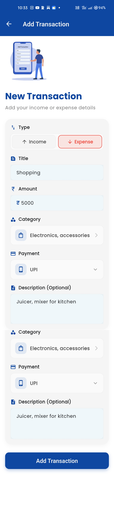
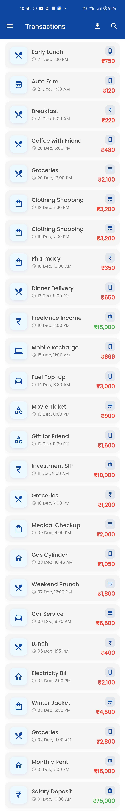
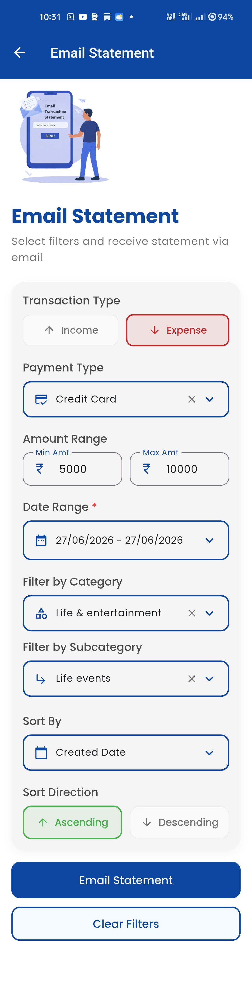
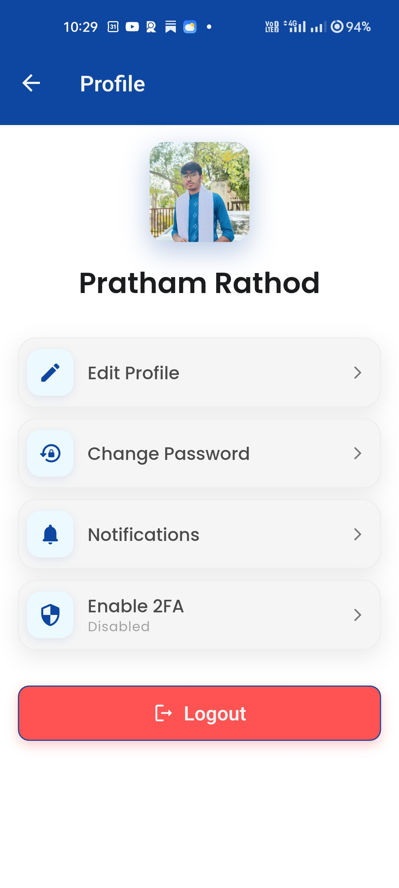
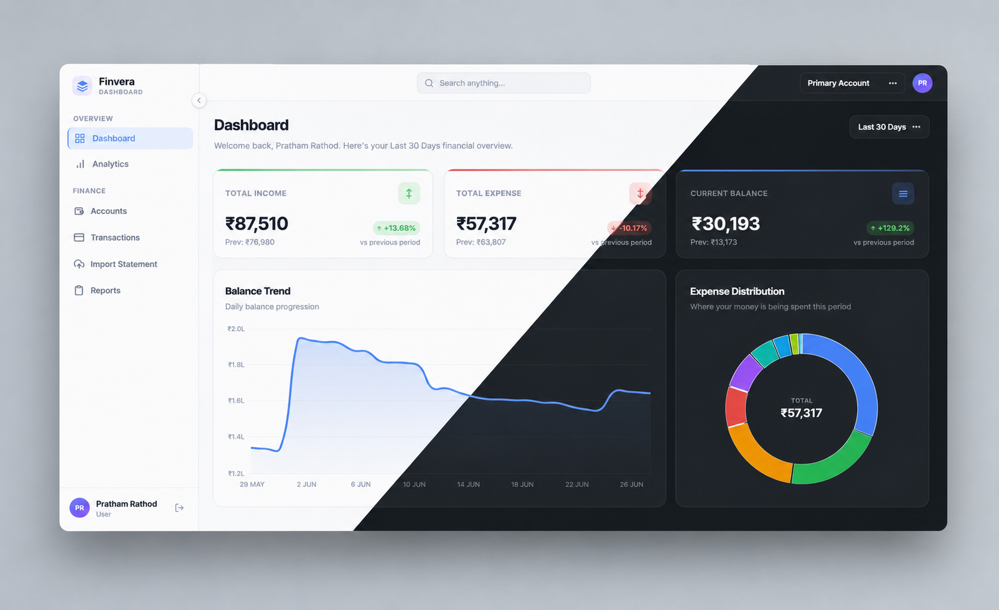
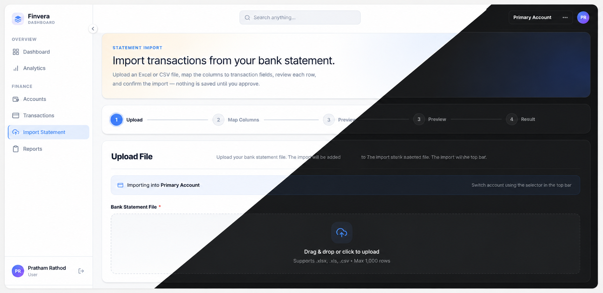

# 💰 Finvera — Personal Finance Tracker & Analyzer

Track income and expenses, manage financial accounts, import bank statements, and get AI-powered financial insights — on mobile and web.

---

## 📱 Mobile App

### Dashboard
> Real-time overview of your finances — income vs expenses, top categories, and recent transactions.

  

---

### Transaction Management
> Add, edit, and delete transactions with category selection, payment type, and account assignment.

  
  &nbsp;&nbsp;&nbsp;
  

---

### Email Statement
> Export your transaction history as a PDF and have it delivered straight to your inbox.

  

---

### AI Financial Assistant
> Ask questions about your finances in plain English and get instant, intelligent answers.

  
  &nbsp;&nbsp;&nbsp;
  

---

### Profile
> Manage your account details, profile photo, password, and two-factor authentication.

  

---

## 🌐 Web App

### Dashboard
> The full web experience — income vs expense charts, category breakdowns, and account summaries.

  

---

### Transaction Management
> Filter, sort, and manage all transactions with advanced search and bulk actions.

  

---

### Bank Statement Import
> Upload PDF or CSV bank statements and auto-categorize transactions using smart rules.

  

---

## ✨ Features

| Feature | Mobile | Web |
|---|:---:|:---:|
| Email / Google / TOTP 2FA Auth | ✅ | ✅ |
| Account & Transaction Management | ✅ | ✅ |
| Income vs Expense Dashboard | ✅ | ✅ |
| Category & Subcategory Management | ✅ | ✅ |
| Bank Statement Import (PDF / CSV) | — | ✅ |
| Transaction Auto-categorization Rules | ✅ | ✅ |
| PDF Export & Email Statement | ✅ | ✅ |
| AI Financial Assistant | ✅ | — |
| AI Chart Summary | ✅ | — |
| Biometric Login | ✅ | — |

---

  Built with ❤️ by <a href="https://github.com/pratham-developer">Pratham</a> &nbsp;&amp;&nbsp; <a href="https://github.com/devpalsanawala">Palsanawala</a> (Co-developer)

